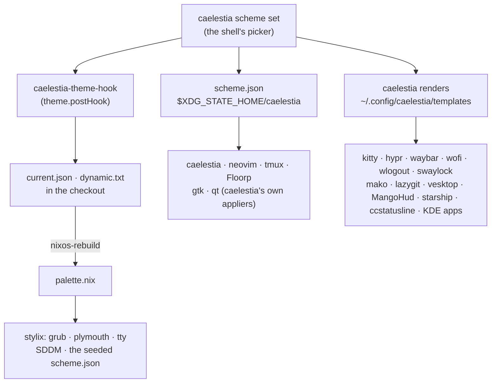

# Colours

caelestia picks the scheme. Whatever you choose in the shell's scheme picker,
`dynamic` included, recolours the desktop on the spot. A rebuild then brings
the parts only Nix can reach (the boot screens, the greeter and the tty) up
to the same scheme.

## Choosing a scheme

The picker, or `caelestia scheme set -n <name> -f <flavour> -m <mode>`. Ours
is `hu-tao`, flavour `red`, mode `dark`:
`dotfiles/caelestia/schemes/hu-tao/red/dark.txt`, 110 keys in caelestia's own
format. `dynamic` generates its colours from the wallpaper. Every scheme
caelestia ships works too, since they all carry the same 110 keys.

The CLI lists schemes only out of its own package (`data/schemes`), never
from `~/.config`. So `home/apps/caelestia.nix` overrides the CLI to copy
`dotfiles/caelestia/schemes/` in beside upstream's. A new scheme is a new
`<name>/<flavour>/<mode>.txt` there and a rebuild.

`<mode>` has to be `dark` or `light`: caelestia feeds it to GTK's
`prefer-<mode>` and to its `qt<mode>.colors` template. A variant goes in the
flavour, which is why ours is `hu-tao/red/dark` and not `hu-tao/default/dark-red`.

## What follows a switch, and when

| When                     | What                                                                | How                                                                                                |
| ------------------------ | ------------------------------------------------------------------- | -------------------------------------------------------------------------------------------------- |
| at once                  | caelestia                                                           | its own                                                                                            |
| at once                  | neovim                                                              | `utils/colors.lua` watches `scheme.json` and re-applies catppuccin, lualine                        |
| at once                  | kitty, waybar, mako, tmux, Hyprland                                 | a template, then the hook's USR1, USR2, `makoctl reload`, `tmux-apply-colors.sh`, `hyprctl reload` |
| at once                  | vesktop, starship, ccstatusline                                     | a template; the hook touches the theme links Vencord watches, the rest read per render             |
| at once                  | Floorp                                                              | CaelestiaFox from AMO, fed by its native app (`pkgs/caelestiafox.nix`)                             |
| next time the app starts | GTK and Qt apps                                                     | caelestia's `enableGtk`, `enableQt`: `gtk.css`, `~/.config/qtengine`                               |
| next time the app starts | lazygit, wofi, wlogout, swaylock, MangoHud, KDE apps (`kdeglobals`) | a template                                                                                         |
| next rebuild             | grub, plymouth, the tty, SDDM                                       | `palette.nix`, off `current.json`                                                                  |

## Templates

A template is a config file whose colours are caelestia fields,
`{{ primary.hex }}` for a bare `rrggbb`, `{{ primary.red }}` and friends for a
channel. caelestia renders every file in `~/.config/caelestia/templates/` into
`$XDG_STATE_HOME/caelestia/theme/` of the same name, on every switch, and the
app's own path is a link to the rendered file.

`hutao.caelestiaTemplates` (in `home/apps/caelestia.nix`) is the one list of
them: a name, a source, and the path to link. `home/apps/dotfiles.nix` feeds
it from `recolour`, the table of every colour literal in the dotfiles by the
scheme key it means, substituted with `palette.template`'s fields instead
of hex. The literals stay in the files, so the configs remain valid when
`~/.config` points at the raw tree, and `--replace-fail` still turns a moved
literal into a failed build. `theme.nix` adds `kdeglobals`, and
`ccstatusline.nix` the status line's settings.

A rebuild can change a template without the scheme changing, and caelestia
only renders on a switch, so activation renders them too
(`caelestia-render-templates`, the same fields) and runs the hook's reloads.

Hyprland is the odd one: `~/.config/hypr` is linked whole, so
`look_and_feel.lua` `dofile()`s a rendered `hypr-colours.lua` instead of being
a template itself. It falls back to its own literals, which the build still
substitutes with the scheme of that build.

Off in `cli.json`, because something here does the job: `enableTerm` (kitty
reloads `mocha.conf`, where caelestia's escape sequences would paint its own
terminal mapping over it), `enableHypr` and `enableDiscord` (both templates
here).

## Recording the pick

`caelestia-theme-hook` runs after every switch. It writes the scheme's name,
flavour, mode and variant to `dotfiles/caelestia/current.json`, and on
`dynamic` the generated colours to `dotfiles/caelestia/dynamic.txt`, in
caelestia's format. Both are tracked, so the next rebuild builds the scheme
you are looking at and the pick is in git once you commit it. A flake reads a
tracked file's working-tree contents, so the rebuild does not wait for the
commit.

The hook finds the checkout through `$XDG_STATE_HOME/hutao/flake-path`, which
activation writes from `hutao.flakePath` (default
`~/Projects/nixos-dotfiles`). A clone elsewhere sets that option, or edits the
file for a quick fix. With no checkout there it records nothing and says so in
a notification. The path cannot be worked out: a flake is evaluated from its
copy in the store.

## GTK and Qt

caelestia owns both. Stylix's gtk and qt targets are off, so there is one
writer per file:

- **GTK**: caelestia writes `gtk-3.0/gtk.css` and `gtk-4.0/gtk.css` and sets
  `adw-gtk3-dark` in dconf. Home Manager keeps the theme package, the font
  (from `stylix.fonts`) and the icons, and sets no GTK 4 theme, because that
  would make it write `gtk-4.0/gtk.css` too.
- **Qt**: `QT_QPA_PLATFORMTHEME=qtengine`, with the Darkly style. caelestia
  writes `~/.config/qtengine/config.json` and the colours beside it.

## Worth knowing

- **qtengine is Qt 6 only.** Nothing here is Qt 5; see `modules/desktop/fcitx5.nix`
  for the one thing that was.
- **The Qt font is set in caelestia's own template.** The CLI override in
  `home/apps/caelestia.nix` patches `qtengine.json` to `stylix.fonts.monospace`
  (JetBrainsMono Nerd Font) at weight 300, Light, and the applications size.
  caelestia rewrites `config.json` on every switch, so editing that file does
  nothing lasting.
- **Every switch dirties the checkout** when the scheme differs from the
  committed one. Commit `current.json` and `dynamic.txt` when you want the
  pick kept.
- **ANSI green, blue, cyan and magenta are one colour in hu-tao.** The scheme
  sets `term2`, `term4`, `term6`, `term10`, `term12` and `term14` to the same
  `ff9b8a`. Retune those keys to tell them apart in the terminal.
- **CaelestiaFox is two halves, and only one is Nix's.** Install the
  extension by hand from
  [AMO](https://addons.mozilla.org/en-US/firefox/addon/caelestiafox).
  Floorp's wrapper links the native app's manifest into
  `~/.mozilla/native-messaging-hosts` when Floorp starts (Floorp reads it from
  there, though its profile is in `~/.config/floorp`), so restart Floorp after
  the first rebuild that brings it.
- **`palette.nix` holds no hex of its own.** A missing colour is a key to add
  to the scheme, not a constant to inline.
