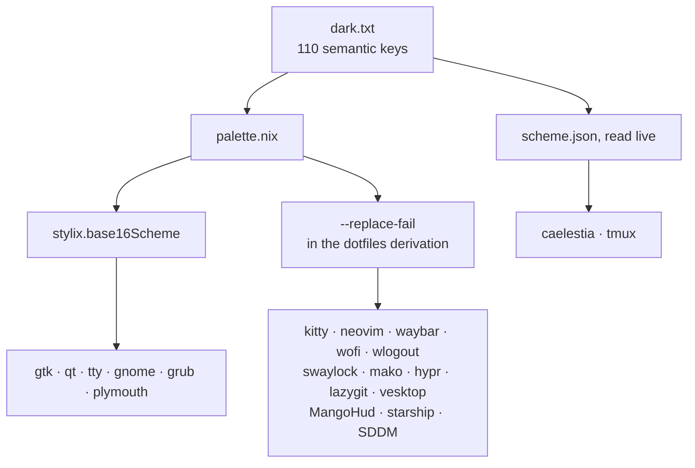

# Colours

There is one source: `dotfiles/caelestia/schemes/hu-tao/default/dark.txt`,
caelestia's own format, 110 semantic keys. It stays canonical, so
`caelestia scheme set hu-tao` still round-trips it. `palette.nix` parses it,
and everything else is generated from it at build time.

| Target                                                                            | How                                                                       |
| --------------------------------------------------------------------------------- | ------------------------------------------------------------------------- |
| gtk, qt, **the tty**, gnome, grub, plymouth                                       | `stylix.base16Scheme = palette.base16`, the 16 slots read out by name     |
| caelestia                                                                         | the file itself; the seeded `scheme.json` is generated from it            |
| tmux                                                                              | live, off `scheme.json`, via `dot-profile.d/colors.sh`                    |
| kitty                                                                             | `mocha/mocha.conf`, generated whole, `color0..15` from `term0..15`        |
| neovim                                                                            | substituted; the nine-step ramp interpolated between the scheme's anchors |
| vesktop, waybar, wofi, wlogout, swaylock, mako, hypr, lazygit, MangoHud, starship | substituted in the dotfiles derivation                                    |
| SDDM                                                                              | substituted in `pkgs/sddm-hu-tao.nix`                                     |

Everything outside stylix is a `--replace-fail` against the literal still in
the dotfile. The literal stays there on purpose: the configs remain valid when
`~/.config` points at the raw tree, and a value that moves upstream fails the
build instead of quietly no longer following the scheme.

Stylix's own per-app targets are off (`stylix.autoEnable = false`). The
dotfiles theme those apps themselves, and two writers for one file is a
conflict. SDDM has no stylix target at all, which is why the greeter is
vendored at `assets/sddm-hu-tao/`. Its background is fan art, so it comes from
the private `third-party-assets` input (`assets/third-party/sddm-hu-tao/`
there) and is copied in at build time.

## Worth knowing

- **ANSI green, blue, cyan and magenta are one colour.** The scheme sets
  `term2`, `term4`, `term6`, `term10`, `term12` and `term14` to the same
  `ff9b8a`. Retune those keys to tell them apart in the terminal.
- **`palette.nix` holds no hex of its own.** A missing colour is a key to add
  to the scheme, not a constant to inline.
