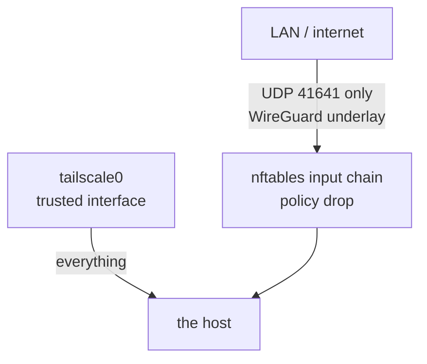

# Network and the tailnet

The rule is short: **the physical network gets one open port, and the tailnet
gets everything.** Anything that serves another machine of mine listens only
where `tailscale0` can reach it.

## The firewall

`modules/firewall.nix` is the NixOS firewall module on nftables, not a
hand-written ruleset. (The vps repo writes its own because docker leaves it no
choice; doing that here would silently void `trustedInterfaces`,
`checkReversePath` and every module's `openFirewall`.)

- **Inbound:** one UDP port, Tailscale's own, so peers connect directly instead
  of through a DERP relay. WireGuard drops anything not from a known node key.
- **SSH is not a firewall port.** Tailscale SSH serves the tailnet itself and
  never touches sshd, so tcp 22 is closed on every physical interface.
- **IPv4 ping is off.** ICMPv6 stays on, because dropping it breaks path MTU
  and neighbour discovery.
- **Egress is unfiltered.** A drop policy there would have to list every port a
  browser, game or updater picks, and each miss would look like a network fault.
- **Refused connections are logged**: `journalctl -k | grep refused` is how to
  tell a firewall drop from a broken service.

## Tailscale

`modules/tailscale.nix`, imported by `hosts/common`, so the real machines join
and `hutao-vm` does not.

- It joins on first boot from `tailscale_authkey`, with `--ssh`. A used-up or
  expired key fails `tailscaled-autoconnect` without blocking the boot.
- `--hostname` is set from `networking.hostName`, because the tailnet name lives
  in Tailscale's control plane and never follows a rename on its own.
- `--operator=hutao`, so `tailscale set` (every exit-node switch) works without
  root.
- `useRoutingFeatures = "both"` carries the forwarding sysctls, and
  `checkReversePath = "loose"` keeps strict rpfilter from dropping Tailscale's
  replies and degrading direct connections to DERP.

**MagicDNS needs `services.resolved`.** `--accept-dns=true` only tells
tailscaled to want the tailnet's DNS; without resolved it has nowhere to
install it, every Tailscale-side check reports healthy, and only name lookups
are dead. It cost a deploy: deploy-rs addresses hosts by MagicDNS name and died
on `Could not resolve hostname`. The full story is in the module's comment.

## Syncthing

`modules/syncthing.nix` shares one folder, `~/syncthing`, between the laptop,
the desktop, the VPS and a phone, over the tailnet only: nothing opens 8384 or
22000 on a physical interface.

- Peers are declared, each machine declaring the others, so no first
  connection has to be accepted by hand. The phone never imports the module;
  its key is its MagicDNS name. Device IDs are public (a hash of the
  node's certificate) and committed.
- `overrideDevices` and `overrideFolders` stay **false**. True makes the lists
  the whole truth and deletes anything added in the GUI on every activation.
- The GUI password is `syncthing_gui_password`; see [Secrets](secrets.md).
