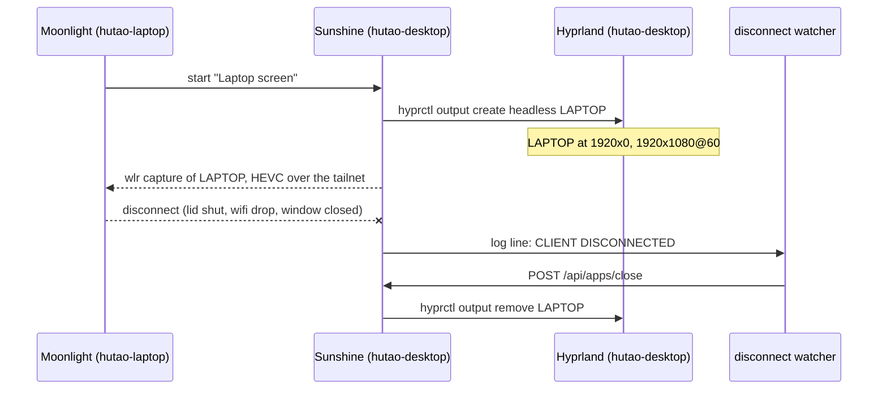

# The laptop as a third monitor

The laptop can be the desktop's third screen, right of DP-1, with the
desktop's own mouse and keyboard moving onto it and windows dragging across.
A laptop's HDMI port only outputs, so there is no cable that does this. Instead
the desktop draws a monitor that does not physically exist, and streams it.



| Piece                     | Where                                                          |
| ------------------------- | -------------------------------------------------------------- |
| Sunshine, the server      | `services.sunshine` in `hosts/hutao-desktop/default.nix`       |
| the `LAPTOP` monitor rule | `hosts/hutao-desktop/monitors.lua`                             |
| the disconnect watcher    | `systemd.user.services.sunshine-quit-on-disconnect`, same file |
| the web UI login          | `sunshine_password`, and the `sunshine-netrc` template         |
| Moonlight, the viewer     | `hosts/hutao-laptop/default.nix`                               |

## Using it

On the laptop: Moonlight → `hutao-desktop` → **Laptop screen**. To stop, close
the stream or the lid; the screen goes away on its own.

Pairing is once per laptop, and it survives restarts. If it is ever lost (a
reinstall, or `~/.config/sunshine` wiped), pair from the laptop with a PIN of
your choosing and give Sunshine the same PIN:

```bash
moonlight pair hutao-desktop --pin 1234     # on the laptop; waits
```

Then enter the PIN at `https://localhost:47990` on the desktop, logging in as
`hutao` with `sunshine_password`.

**Moonlight's defaults look bad for a desktop.** Its default bitrate is tuned
for games, and text smears at it. In Moonlight's settings use 1080p, 60 FPS,
about 40 Mbps and HEVC; the two machines have a direct LAN path over the
tailnet. These live in Moonlight's own settings file, which it rewrites, so
they are not declared here. (2026-09-25)

## Why it is built this way

- **The monitor exists only while it is streamed.** A permanent headless output
  would be an invisible screen the pointer wanders onto whenever the laptop is
  shut. Sunshine's `prep-cmd` creates it on connect and removes it on quit.
- **wlr capture, not KMS.** A headless output has no CRTC, so there is nothing
  for KMS capture to read; `output_name = "LAPTOP"` picks it by name. The
  `Selected monitor [DP-1]` lines in the log before a stream are encoder probes
  from before the output exists, and are normal.
- **No firewall ports.** `tailscale0` is trusted, so Moonlight reaches Sunshine
  over the tailnet and nowhere else. Avahi, which the Sunshine module turns on,
  is turned back off: mDNS never crosses the tailnet, so Moonlight adds the
  host by name.
- **Audio stays on the desktop** (`stream_audio = disabled`).
- **The login is seeded from sops** on every start. `sunshine --creds` merges
  into `sunshine_state.json`, so paired clients survive the re-seed.

## The disconnect watcher

Sunshine only runs the `undo` half of a `prep-cmd` when the app quits. A plain
disconnect keeps the app running so the client can resume, and that includes
closing the lid, which leaves `LAPTOP` behind as the invisible screen this
design exists to avoid. Sunshine has no disconnect hook. (2026-09-25)

So a user service bound to `sunshine.service` follows Sunshine's journal for
`CLIENT DISCONNECTED` and quits the app through Sunshine's own API. Sunshine
then runs its normal `undo`, its state stays consistent, and the next connect
recreates the monitor. curl sends no `Origin` header, so the API wants basic
auth (from the netrc) but no CSRF token.

It is keyed on that literal log line. If a Sunshine update rewords it, the
watcher silently stops firing, and the symptom is an invisible screen right of
DP-1 after the laptop disconnects. Check with:

```bash
journalctl --user -u sunshine | grep -E 'CLIENT DISCONNECTED|Executing Undo'
```

Each disconnect should be followed within a second by an `Executing Undo Cmd`.
Until the watcher is fixed, `hyprctl output remove LAPTOP` clears the screen by
hand.

**A new user unit does not start on the switch that adds it.** Sunshine is
started by `graphical-session.target`, which is already up when you rebuild,
and the watcher by Sunshine. The first time, run
`systemctl --user start sunshine sunshine-quit-on-disconnect`, or log in again.
