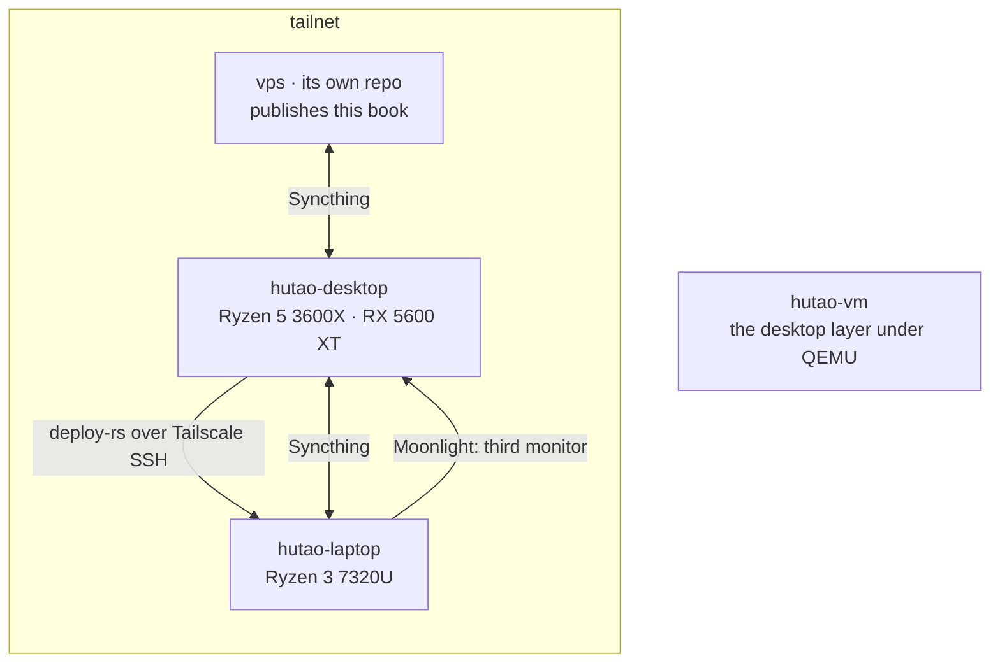

# Introduction

This is the flake behind two workstations: a laptop and a desktop running the
same NixOS on `nixos-unstable`, with LVM-on-LUKS disks, immutable users whose
passwords come from sops, Hyprland with the caelestia shell, and Limine.

The user layer lives here too. `dotfiles/` and `nvim/` are symlinked into
`$HOME` by home-manager, so there is no stow and no second repo to bump: a
config change and the system change it needs are one commit.

## The machines

`hutao-vm` is not a machine. It is the same desktop layer booted in QEMU, for
testing anything above the disk without installing it. See
[Hosts and layers](architecture/hosts.md).

## Where to start

| If you want to                        | Read                                                           |
| ------------------------------------- | -------------------------------------------------------------- |
| know what every host gets, and why    | [Hosts and layers](architecture/hosts.md)                      |
| change a dotfile                      | [The user layer](architecture/user-layer.md)                   |
| change a colour                       | [Colours](architecture/colours.md)                             |
| add or rotate a secret                | [Secrets](architecture/secrets.md)                             |
| use the laptop as a screen            | [The laptop as a third monitor](architecture/third-monitor.md) |
| ship a change                         | [Rebuilding and deploying](operations/deploying.md)            |
| install a machine from nothing        | [Installing a machine](operations/installing.md)               |
| try a desktop change without a reboot | [The VM and the install rehearsal](operations/vm.md)           |
| know why a thing is the way it is     | the comment at the top of the module that does it              |

That last row is the real index. This book says where things are and how they
fit; the reasoning lives next to the code it constrains, where it cannot rot
separately from it.

## Conventions

- **A gotcha has a date** when it was learned the hard way, so a live
  constraint can be told from a superstition.
- **Diagrams are mermaid.** They render here, in the Forgejo web UI, and in a
  pull request that changes one.
